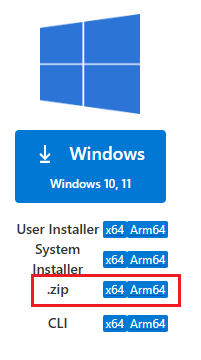

# Visual Studio Code (No Admin Installation)

Install VSCode without administrator privileges using the portable ZIP version.

This setup:

* Does not require admin rights
* Is fully portable
* Works from `C:\sw\vscode`
* Integrates with Git, Node.js, Python, and other tools

---

## 🚀 Download VSCode (Portable Version)

Download from the official site:

* https://code.visualstudio.com/download

Select:

* **Windows**
* **.ZIP version (not installer)**

---

## 📦 Install VSCode (No Admin Required)

### Step 1: Create Directory

```cmd id="vsc01"
mkdir C:\sw\vscode
```

---

### Step 2: Extract Files

Extract the downloaded ZIP into:

```text id="vsc02"
C:\sw\vscode
```

Expected structure:

```text id="vsc03"
C:\sw\vscode
  ├── Code.exe
  ├── bin
  ├── resources
  └── ...
```

---

## ▶️ Run VSCode

```cmd id="vsc04"
C:\sw\vscode\Code.exe
```

---

## 🔧 Add VSCode to PATH (Recommended)

To run `code` from anywhere, add:

```text id="vsc05"
C:\sw\vscode\bin
```

📖 See:

* [Environment Variables](../system/environment-variables.md)

---

## ✅ Verify Installation

```cmd id="vsc06"
code --version
```

or

```cmd id="vsc07"
where code
```

---

## ⚙️ Enable Command Line Integration

If `code` is not recognized:

1. Open VSCode
2. Press `Ctrl + Shift + P`
3. Run:

   ```
   Shell Command: Install 'code' command in PATH
   ```

> ⚠️ This may not work reliably in portable setups unless PATH is configured manually.

---

## 🎨 Recommended VSCode Settings (No Admin)

Settings file location:

```text id="vsc08"
%userprofile%\AppData\Roaming\Code\User\settings.json
```

---

### Example Configuration

```json id="vsc09"
{
  "editor.fontSize": 18,
  "editor.tabSize": 2,
  "terminal.integrated.fontSize": 16,
  "editor.minimap.enabled": false,
  "workbench.colorTheme": "Default Dark+",
  "terminal.integrated.cursorBlinking": true
}
```
> See [VSCode System Configuration](../system/vscode-config.md#-full-recommended-vscode-configuration-golden-setup) for more information 
---

## 🔌 Install Extensions (Optional)

```cmd id="vsc10"
code --install-extension ms-python.python
code --install-extension ms-vscode.cpptools
code --install-extension esbenp.prettier-vscode
code --install-extension GitHub.copilot
```

List installed extensions:

```cmd id="vsc11"
code --list-extensions
```

---

## 🧩 Common Issues

---

### ❌ `code` not recognized

**Cause**
PATH not set correctly

**Fix**

* Add:

  ```
  C:\sw\vscode\bin
  ```
* Restart terminal

---

### ❌ VSCode opens but CLI doesn’t work

**Cause**
Portable version does not auto-register CLI tools

**Fix**

* Use PATH method (recommended)
* Do not rely on installer-based integration

---

### ❌ Extensions not installing

**Fix**

* Ensure internet connection
* Run VSCode once manually
* Verify extension ID

---

## 🧠 Best Practice Setup

Recommended structure:

```text id="vsc12"
C:\sw\
  ├── vscode
  ├── git
  ├── node
  ├── python
```

Then:

* Add only required `bin` folders to PATH
* Keep installations isolated and portable

---

## 📌 Related Guides

---

### 🛠 System Setup

* [Environment Variables](../system/environment-variables.md)
* [Registry Tweaks (Open with VSCode)](../system/registry-tweaks.md#-open-with-vscode#-open-with-vscode)
* [VSCode System Configuration](../system/vscode-config.md)

---

### 🧰 Development Tools

* [Git Setup](git.md)
* [Node.js Setup](node.md)
* [Python Setup](python.md)
