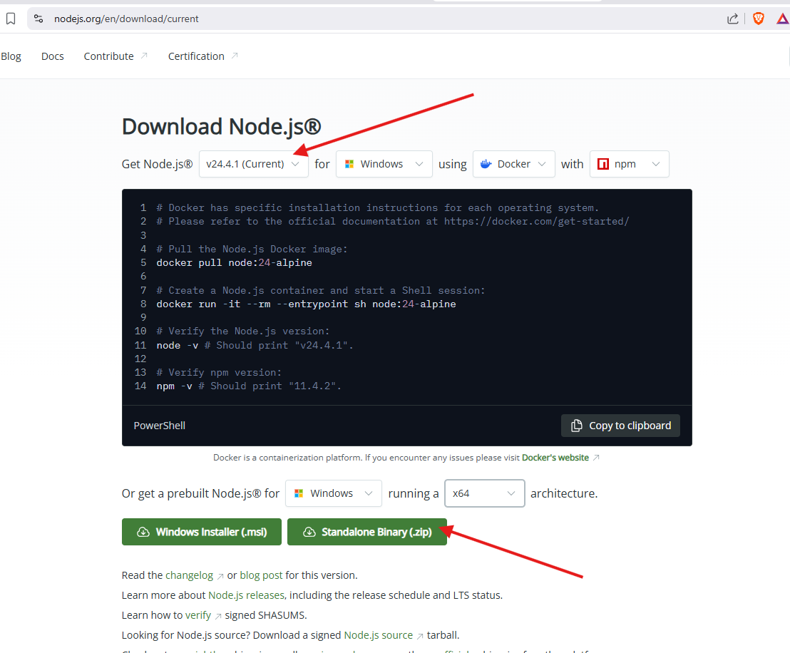
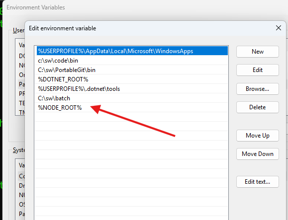
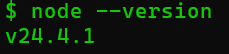

### Node install
1. Download node zip version in https://nodejs.org/en/download/


2. Extract 
```bash
powershell -c Expand-Archive -Path "%userprofile%\downloads\node-v24.4.1-win-x64.zip" -DestinationPath "c:\sw\node"
```

3. Create NODE_ROOT
```bash
SETX NODE_ROOT c:\sw\node\node-v24.4.1-win-x64
```
3. Put in user path
```
rundll32 sysdm.cpl,EditEnvironmentVariables
```


4. Save and Test
```bash
node --version
```
