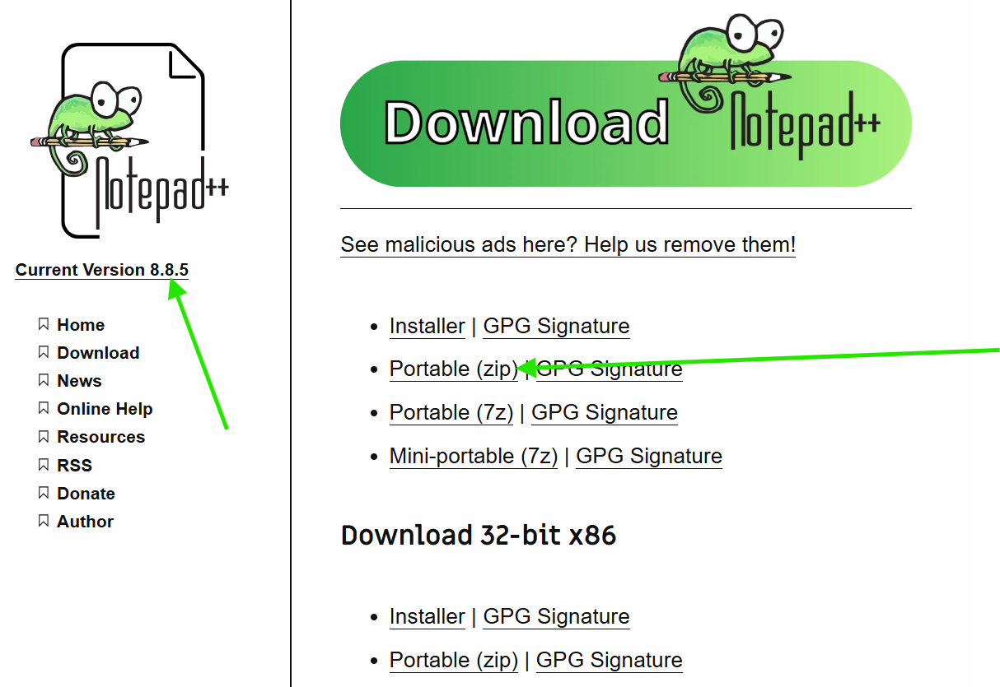

# Notepad++ Installation (No Admin Required)

A comprehensive guide for installing Notepad++ on Windows without administrator privileges using the portable version.

## Table of Contents

1. [Prerequisites](#prerequisites)
2. [Download Notepad++ Portable](#download-notepad-portable)
3. [Installation Steps](#installation-steps)
4. [Configuration](#configuration)
5. [Plugin Installation](#plugin-installation)
6. [VSCode Integration](#vscode-integration)
7. [Context Menu Integration](#context-menu-integration)
8. [Troubleshooting](#troubleshooting)

## Prerequisites

- Windows 10 or later
- User account with standard privileges (no admin required)
- Internet connection for downloading
- Approximately 50MB of free disk space
- Basic familiarity with file extraction

## Download Notepad++ Portable

Notepad++ offers a portable version that doesn't require installation or administrator rights.

### 1. Visit Official Download Page

Go to [Notepad++ Downloads](https://notepad-plus-plus.org/downloads/)

### 2. Download Portable Version

1. **Find the latest version** (e.g., v8.6.9)
2. **Look for "Portable" section**
3. **Download the appropriate version:**
   - **64-bit systems:** `npp.8.6.9.portable.x64.zip`
   - **32-bit systems:** `npp.8.6.9.portable.zip`

> **💡 Tip:** Most modern Windows systems are 64-bit. If unsure, download the 64-bit version first.



## Installation Steps

### 1. Create Installation Directory

```cmd
# Create directory structure
mkdir C:\sw\notepadpp
```

### 2. Extract Portable Archive

1. **Navigate to your Downloads folder**
2. **Right-click the downloaded zip file**
3. **Select "Extract All..."**
4. **Extract to:** `C:\sw\notepadpp`
5. **Click "Extract"**

### 3. Verify Installation

```cmd
# Navigate to installation directory
cd C:\sw\notepadpp

# List files to verify extraction
dir

# Test Notepad++ launch
notepad++.exe
```

### 4. Add to PATH (Optional)

Adding Notepad++ to your PATH allows you to launch it from any command prompt location.

#### Using Command Line
```cmd
setx PATH "%PATH%;C:\sw\notepadpp"
```

#### Using GUI (Recommended)
```cmd
rundll32 sysdm.cpl,EditEnvironmentVariables
```

1. **Click "New" in User variables**
2. **Add:** `C:\sw\notepadpp`
3. **Click "OK"**

### 5. Verify PATH Installation

```cmd
# Close and reopen command prompt, then test
notepad++
```

## Configuration

### 1. Initial Setup

When you first launch Notepad++, you may want to configure some basic settings:

1. **Launch Notepad++**
   ```cmd
   C:\sw\notepadpp\notepad++.exe
   ```

2. **Configure Preferences**
   - Go to **Settings** → **Preferences**
   - **General Tab:**
     - ✅ Enable "Remember current session for next launch"
     - ✅ Enable "Auto-update"
   - **Backup Tab:**
     - ✅ Enable "Remember current session for next launch"
     - Set backup directory: `C:\sw\notepadpp\backup`

### 2. Theme Configuration

**Dark Theme Setup:**
1. **Go to Settings** → **Style Configurator**
2. **Select theme:** "Obsidian" or "Monokai"
3. **Click "Save & Close"**

**Custom Theme (Optional):**
1. **Download themes** from [Notepad++ Themes](https://github.com/notepad-plus-plus/notepad-plus-plus/wiki/User-Defined-Language-Files)
2. **Place theme files** in: `C:\sw\notepadpp\themes\`
3. **Restart Notepad++**
4. **Apply theme** via Settings → Style Configurator

### 3. Font Configuration

1. **Go to Settings** → **Style Configurator**
2. **Select "Global Styles"** → "Default Style"
3. **Set Font:** Consolas, Courier New, or Fira Code
4. **Set Size:** 12 or 14
5. **Click "Save & Close"**

## Plugin Installation

Notepad++ supports plugins that extend functionality. The portable version includes the Plugin Manager.

### 1. Access Plugin Manager

1. **Go to Plugins** → **Plugins Admin**
2. **Browse available plugins**

### 2. Recommended Plugins

**Essential Plugins:**
- **JSON Viewer:** Format and validate JSON files
- **XML Tools:** XML formatting and validation
- **Compare:** File comparison tool
- **NppFTP:** FTP/SFTP client integration
- **Markdown Panel:** Live markdown preview

**Installation Steps:**
1. **Open Plugins** → **Plugins Admin**
2. **Search for plugin name**
3. **Check the checkbox** next to desired plugins
4. **Click "Install"**
5. **Restart Notepad++** when prompted

### 3. Manual Plugin Installation

For plugins not available through Plugin Manager:

1. **Download plugin DLL file**
2. **Copy to:** `C:\sw\notepadpp\plugins\[PluginName]\`
3. **Restart Notepad++**

## VSCode Integration

You can configure Notepad++ as an external editor in VSCode for specific file types.

### 1. VSCode Settings Configuration

Add to your VSCode `settings.json`:

```json
{
  "files.associations": {
    "*.log": "plaintext",
    "*.ini": "ini",
    "*.cfg": "ini"
  },
  "workbench.editorAssociations": {
    "*.log": "default"
  }
}
```

### 2. External Editor Task

Create `.vscode/tasks.json` in your project:

```json
{
  "version": "2.0.0",
  "tasks": [
    {
      "label": "Open in Notepad++",
      "type": "shell",
      "command": "C:\\sw\\notepadpp\\notepad++.exe",
      "args": ["${file}"],
      "group": "build",
      "presentation": {
        "echo": true,
        "reveal": "never",
        "focus": false,
        "panel": "shared"
      }
    }
  ]
}
```

**Usage:**
1. **Open Command Palette** (`Ctrl+Shift+P`)
2. **Type:** "Tasks: Run Task"
3. **Select:** "Open in Notepad++"

## Context Menu Integration

Add "Edit with Notepad++" to Windows context menu for easy file access.

### 1. Create Registry File

Create a file named `notepadpp-context-menu.reg`:

```cmd
notepad notepadpp-context-menu.reg
```

### 2. Add Registry Content

Copy this content into the file:

```reg
Windows Registry Editor Version 5.00

[HKEY_CURRENT_USER\Software\Classes\*\shell\Edit with Notepad++]
@="Edit with Notepad++"
"Icon"="C:\\sw\\notepadpp\\notepad++.exe"

[HKEY_CURRENT_USER\Software\Classes\*\shell\Edit with Notepad++\command]
@="\"C:\\sw\\notepadpp\\notepad++.exe\" \"%1\""

[HKEY_CURRENT_USER\Software\Classes\Directory\Background\shell\Notepad++ Here]
@="Open Notepad++ Here"
"Icon"="C:\\sw\\notepadpp\\notepad++.exe"

[HKEY_CURRENT_USER\Software\Classes\Directory\Background\shell\Notepad++ Here\command]
@="\"C:\\sw\\notepadpp\\notepad++.exe\" \"%V\""
```

### 3. Apply Registry Changes

1. **Double-click** `notepadpp-context-menu.reg`
2. **Click "Yes"** when prompted
3. **Click "OK"** when changes are applied

**What to Expect:**
- Right-click any file → See "Edit with Notepad++" option
- Right-click in empty folder space → See "Open Notepad++ Here" option

### 4. Remove Context Menu (If Needed)

Create `remove-notepadpp-context.reg`:

```reg
Windows Registry Editor Version 5.00

[-HKEY_CURRENT_USER\Software\Classes\*\shell\Edit with Notepad++]
[-HKEY_CURRENT_USER\Software\Classes\Directory\Background\shell\Notepad++ Here]
```

## Troubleshooting

### Common Issues

#### 1. Notepad++ Won't Launch
**Problem:** Double-clicking notepad++.exe does nothing

**Solutions:**
- Check if antivirus is blocking the executable
- Verify all files were extracted properly
- Try running as current user (not administrator)
- Check Windows Event Viewer for error details

#### 2. Plugins Not Loading
**Problem:** Installed plugins don't appear in menu

**Solutions:**
- Verify plugin files are in correct directory: `C:\sw\notepadpp\plugins\`
- Check plugin compatibility with your Notepad++ version
- Restart Notepad++ after plugin installation
- Check if plugin requires additional dependencies

#### 3. Context Menu Not Appearing
**Problem:** Right-click menu doesn't show Notepad++ option

**Solutions:**
- Verify registry file was applied successfully
- Restart Windows Explorer: `taskkill /f /im explorer.exe && start explorer.exe`
- Check if path in registry matches actual installation path
- Ensure you're modifying HKEY_CURRENT_USER (not HKEY_LOCAL_MACHINE)

#### 4. File Associations Not Working
**Problem:** Files don't open with Notepad++ by default

**Solutions:**
- Right-click file → "Open with" → "Choose another app"
- Select Notepad++ and check "Always use this app"
- Or use Windows Settings → Apps → Default apps

### Performance Optimization

#### 1. Disable Unnecessary Features

For better performance on older systems:

1. **Settings** → **Preferences** → **MISC**
   - ✅ Disable "Enable Notepad++ auto-updater"
   - ✅ Disable "Enable ghost typing" (if not needed)

2. **Settings** → **Preferences** → **Backup**
   - Adjust backup settings based on needs
   - Consider disabling if not required

#### 2. Plugin Management

- **Disable unused plugins:** Plugins → Plugins Admin → Installed → Uncheck unused plugins
- **Regular cleanup:** Remove plugins you no longer use

### Useful Keyboard Shortcuts

```
Ctrl + N          New file
Ctrl + O          Open file
Ctrl + S          Save file
Ctrl + Shift + S  Save As
Ctrl + F          Find
Ctrl + H          Find and Replace
Ctrl + G          Go to line
Ctrl + D          Duplicate line
Ctrl + L          Delete line
Ctrl + Shift + Up/Down  Move line up/down
Ctrl + /          Toggle comment
F11               Full screen
Ctrl + Mouse Wheel     Zoom in/out
```

### File Locations

- **Installation:** `C:\sw\notepadpp\`
- **Configuration:** `C:\sw\notepadpp\config.xml`
- **Plugins:** `C:\sw\notepadpp\plugins\`
- **Themes:** `C:\sw\notepadpp\themes\`
- **Backup:** `C:\sw\notepadpp\backup\` (if configured)
- **Session:** `C:\sw\notepadpp\session.xml`

## Advanced Configuration

### 1. Custom Language Definitions

Create custom syntax highlighting for specific file types:

1. **Language** → **User Defined Language** → **Create New**
2. **Configure syntax rules** for your file type
3. **Save as:** `MyLanguage.xml` in `C:\sw\notepadpp\userDefineLangs\`

### 2. Macro Recording

Automate repetitive tasks:

1. **Macro** → **Start Recording**
2. **Perform your actions**
3. **Macro** → **Stop Recording**
4. **Macro** → **Save Current Recorded Macro**
5. **Assign keyboard shortcut** if desired

### 3. Multi-Instance Configuration

Run multiple Notepad++ instances:

1. **Settings** → **Preferences** → **Multi-Instance & Date**
2. **Select:** "Always in multi-instance mode"
3. **Restart Notepad++**

## Best Practices

1. **Regular Backups:** Enable session backup for important work
2. **Plugin Updates:** Keep plugins updated for security and features
3. **Theme Consistency:** Use consistent themes across development tools
4. **Keyboard Shortcuts:** Learn common shortcuts for efficiency
5. **File Organization:** Use project folders and session management
6. **Encoding Awareness:** Pay attention to file encoding (UTF-8, ANSI, etc.)

## Related Links

- [Notepad++ Official Website](https://notepad-plus-plus.org/)
- [Notepad++ Documentation](https://npp-user-manual.org/)
- [Plugin Repository](https://github.com/notepad-plus-plus/notepad-plus-plus/wiki/Plugin-Central)
- [User Defined Languages](https://github.com/notepad-plus-plus/userDefinedLanguages)
- [Back to Main Guide](readme.md)