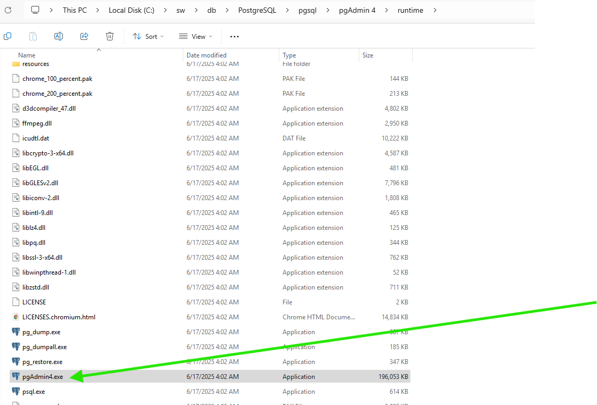
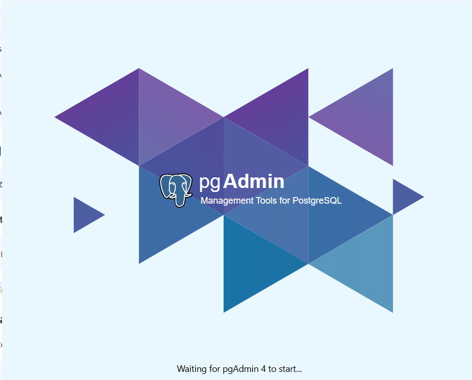
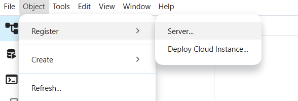
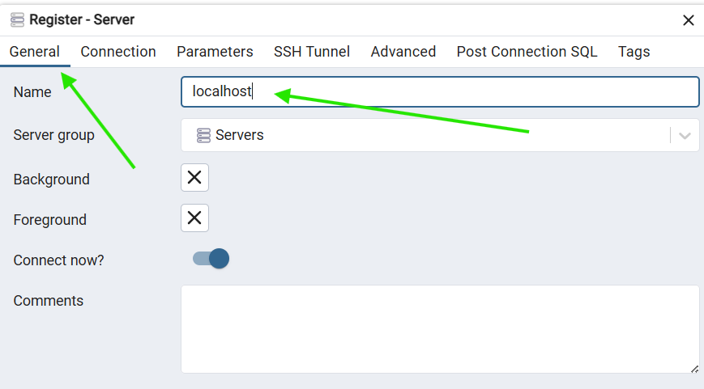
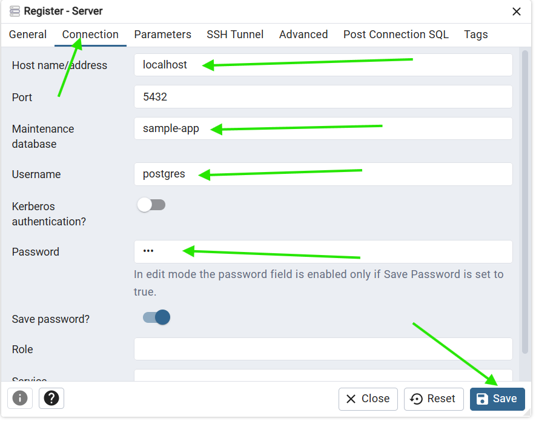
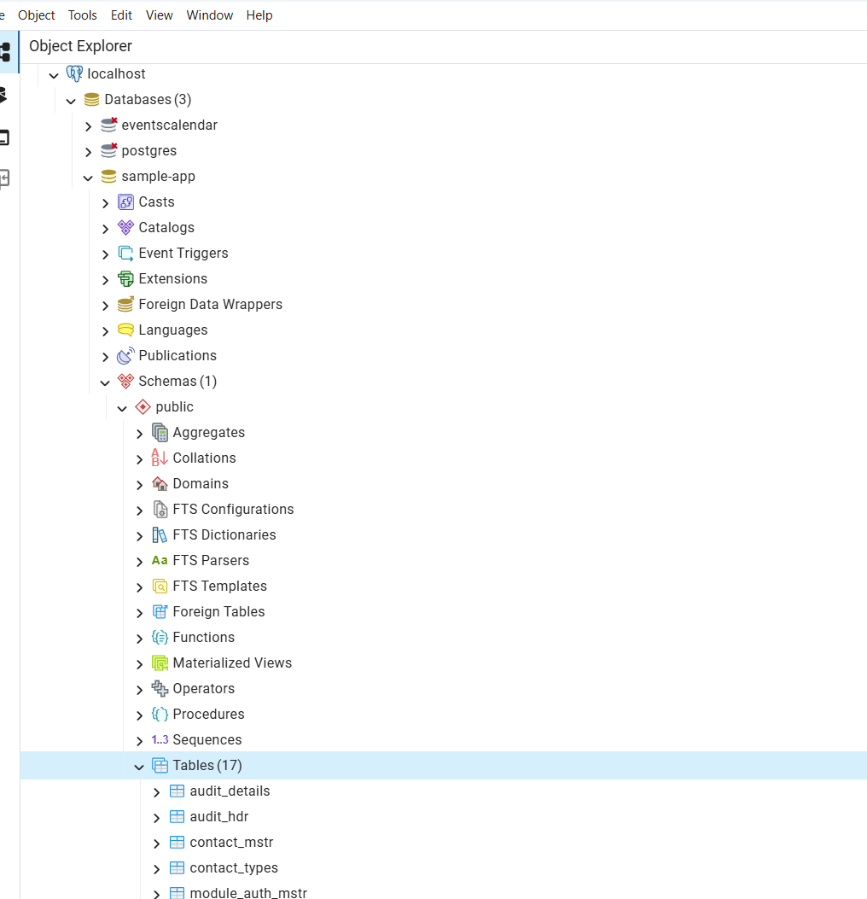

# PostgreSQL Installation (No Admin Required)

A comprehensive guide for installing PostgreSQL on Windows without administrator privileges using portable binaries.

## Table of Contents

1. [Prerequisites](#prerequisites)
2. [Download PostgreSQL](#download-postgresql)
3. [Installation Steps](#installation-steps)
4. [Database Initialization](#database-initialization)
5. [Server Management](#server-management)
6. [User and Database Management](#user-and-database-management)
7. [Testing and Verification](#testing-and-verification)
8. [Troubleshooting](#troubleshooting)
9. [PG Admin](#pg-admin---sql-gui-tool)

## Prerequisites

- Windows 10 or later
- User account with standard privileges
- Internet connection
- Approximately 200MB of free disk space

## Download PostgreSQL

1. **Visit the Official Download Page**
   - Go to [PostgreSQL Binaries](https://www.enterprisedb.com/download-postgresql-binaries)
   - Select the latest stable version
   - Choose **Windows x86-64** for 64-bit systems

2. **Download ZIP Archive**
   - Download the ZIP file (not the installer)
   - The file will be named something like `postgresql-18.0-2-windows-x64-binaries.zip`

## Installation Steps

### 1. Create Directory Structure

```cmd
mkdir C:\SW\DB\PostgreSQL
```

### 2. Extract PostgreSQL

1. **Extract the downloaded ZIP file** to `C:\SW\DB\PostgreSQL`
2. **Verify the structure:**
   ```
   C:\SW\DB\PostgreSQL\pgsql\
   ├── bin\
   ├── include\
   ├── lib\
   ├── share\
   └── symbols\
   ```

### 3. Add to PATH

```cmd
setx PATH "%PATH%;C:\SW\DB\PostgreSQL\pgsql\bin"
```

**Or use the GUI method:**
```cmd
rundll32 sysdm.cpl,EditEnvironmentVariables
```
Add `C:\SW\DB\PostgreSQL\pgsql\bin` to your PATH.

### 4. Verify Installation

Close and reopen command prompt, then test:

```cmd
postgres -V
psql -V
```

Expected output:
```
postgres (PostgreSQL) 16.1
psql (PostgreSQL) 16.1
```

## Database Initialization

### 1. Set Database Path

```cmd
set DBPATH=C:\SW\DB\PostgreSQL\data\pgdata
```

### 2. Initialize Database Cluster

```cmd
initdb -D %DBPATH% -U postgres -W -E UTF8 -A scram-sha-256
```

**Parameters explained:**
- `-D %DBPATH%`: Database directory
- `-U postgres`: Superuser name
- `-W`: Prompt for password
- `-E UTF8`: Database encoding
- `-A scram-sha-256`: Authentication method

**You will be prompted to enter a password for the postgres user. Remember this password!**

**Reset if needed**
```bash
pg_ctl -D "%DBPATH%" stop
rmdir /q /s %DBPATH%
initdb -D %DBPATH% -U postgres -W -E UTF8 -A scram-sha-256
pg_ctl -D "%DBPATH%" -l logfile start
```
## Server Management

### 1. Start PostgreSQL Server

```cmd
pg_ctl -D "%DBPATH%" -l logfile start
```

### 2. Stop PostgreSQL Server

```cmd
pg_ctl -D "%DBPATH%" stop
```

### 3. Restart PostgreSQL Server

```cmd
pg_ctl -D "%DBPATH%" restart
```

### 4. Check Server Status

```cmd
pg_ctl -D "%DBPATH%" status
```

## User and Database Management

### 1. Connect to PostgreSQL

```cmd
psql -U postgres
```

Enter the password you set during initialization.

### 2. Basic PostgreSQL Commands

```sql
-- Check PostgreSQL version
SELECT version();

-- Show connection info
\conninfo

-- List all databases
\l

-- Connect to a specific database
\c database_name

-- List all tables in current database
\dt

-- Show tables with additional info
\dt+

-- Quit psql
\q
```

### 3. Create User and Database (Method 1)

Using command line tools:

```cmd
# Create user
createuser -U postgres testuser

# Create database
createdb -U postgres testdb

# Connect to PostgreSQL
psql -U postgres
```

Then in PostgreSQL:
```sql
-- Set password for user
ALTER USER testuser WITH ENCRYPTED PASSWORD 'qwerty';

-- Grant privileges
GRANT ALL PRIVILEGES ON DATABASE testdb TO testuser;
GRANT ALL ON SCHEMA public TO testuser;
ALTER DATABASE testdb OWNER TO testuser;

-- Exit
\q
```

### 4. Create User and Database (Method 2)

Using SQL commands only:

```cmd
psql -U postgres
```

```sql
-- Create user
CREATE USER testuser2;

-- Create database
CREATE DATABASE testdb2;

-- Set password
ALTER USER testuser2 WITH ENCRYPTED PASSWORD 'qwerty';

-- Grant privileges
GRANT ALL PRIVILEGES ON DATABASE testdb2 TO testuser2;
GRANT ALL ON SCHEMA public TO testuser2;
ALTER DATABASE testdb2 OWNER TO testuser2;

-- Exit
\q
```

## Testing and Verification

### 1. Test User Connection

```cmd
# Connect as the new user
psql -U testuser2 -d testdb2

# Or with full connection string
psql -h localhost -p 5432 -U testuser -d testdb
```

### 2. Create and Test Table

```sql
-- Create a test table
CREATE TABLE cars (
  id SERIAL PRIMARY KEY,
  brand VARCHAR(255),
  model VARCHAR(255),
  year INT
);

-- Insert test data
INSERT INTO cars (brand, model, year)
VALUES ('Ford', 'Mustang', 1964);

-- Query the data
SELECT * FROM cars;

-- Show table structure
\d cars
```

### 3. Test Basic Operations

```sql
-- Insert more data
INSERT INTO cars (brand, model, year) VALUES 
('Toyota', 'Camry', 2020),
('Honda', 'Civic', 2019),
('BMW', 'X5', 2021);

-- Update data
UPDATE cars SET year = 2022 WHERE brand = 'BMW';

-- Delete data
DELETE FROM cars WHERE year < 2000;

-- Count records
SELECT COUNT(*) FROM cars;
```

## Troubleshooting

### Common Issues

#### 1. Command Not Found
**Problem:** `'postgres' is not recognized as an internal or external command`

**Solutions:**
- Verify PostgreSQL bin directory is in PATH
- Close and reopen command prompt
- Check the installation directory exists

#### 2. Database Initialization Fails
**Problem:** `initdb` command fails

**Solutions:**
- Ensure the data directory doesn't already exist or is empty
- Check you have write permissions to the parent directory
- Try a different data directory location

#### 3. Server Won't Start
**Problem:** `pg_ctl start` fails

**Solutions:**
- Check if another PostgreSQL instance is running
- Verify the data directory path is correct
- Check the log file for error messages:
```cmd
type logfile
```

#### 4. Connection Refused
**Problem:** Cannot connect to PostgreSQL server

**Solutions:**
- Verify the server is running:
```cmd
pg_ctl -D "%DBPATH%" status
```
- Check if the port is available (default: 5432)
- Verify connection parameters (host, port, username, database)

#### 5. Authentication Failed
**Problem:** Password authentication fails

**Solutions:**
- Verify you're using the correct password
- Check the authentication method in `pg_hba.conf`
- Try connecting as the postgres superuser first

### Configuration Files

Important PostgreSQL configuration files:

- **postgresql.conf:** Main configuration file
  - Location: `%DBPATH%\postgresql.conf`
  - Controls server settings like port, memory, logging

- **pg_hba.conf:** Authentication configuration
  - Location: `%DBPATH%\pg_hba.conf`
  - Controls who can connect and how they authenticate

### Useful Commands

```cmd
# Show PostgreSQL installation directory
pg_config --bindir

# Show data directory
pg_config --configure

# Check server status
pg_ctl -D "%DBPATH%" status

# View server log
type "%DBPATH%\log\postgresql-*.log"

# Backup database
pg_dump -U postgres -d testdb > backup.sql

# Restore database
psql -U postgres -d testdb < backup.sql
```
## PG Admin - SQL Gui Tool



- Create New Connection





### File Locations

- **PostgreSQL Installation:** `C:\SW\DB\PostgreSQL\pgsql`
- **Data Directory:** `C:\SW\DB\PostgreSQL\data\pgdata`
- **Log Files:** `%DBPATH%\log\`
- **Configuration:** `%DBPATH%\postgresql.conf`
- **PGAdmin:** `C:\sw\db\PostgreSQL\pgsql\pgAdmin 4\runtime\pgAdmin4.exe`

> Alternative is to install zip version of DB Beaver Community https://dbeaver.io/download/

## Best Practices

1. **Regular Backups:** Use `pg_dump` to backup your databases regularly
2. **User Management:** Create specific users for applications, don't use postgres for everything
3. **Security:** Use strong passwords and appropriate authentication methods
4. **Monitoring:** Check log files regularly for errors or warnings
5. **Updates:** Keep PostgreSQL updated to the latest stable version

## Related Links

- [PostgreSQL Official Documentation](https://www.postgresql.org/docs/)
- [PostgreSQL Binaries Download](https://www.enterprisedb.com/download-postgresql-binaries)
- [PostgreSQL Tutorial](https://neon.com/postgresql/tutorial)
- [Back to Main Guide](readme.md)
