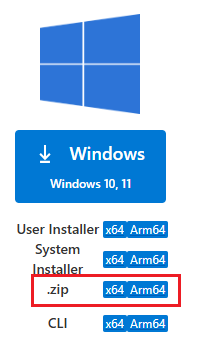
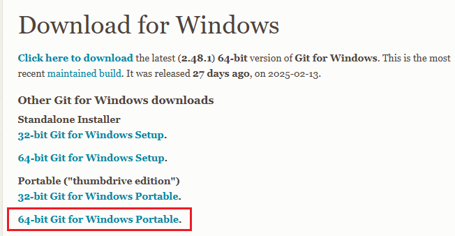

# Non Admin Installs
1. [VSCode](#installing-vscode)
2. [Git](#installing-git)
3. [dotnet](#install-dotnet)
4. [Python](#install-python)
    - [pyenv-win](#install-pyenv-win)
5. [PostgreSQL](#install-postgresql)
1. [Warning](#warning)
1. [Others](#others)

### Installing VSCode
1. Download [VSCode][1] windows .zip version 
  
1. Extract to c:\sw\code
1. Add c:\sw\code\bin to [path](#adding-to-path)

### Installing Git
1. Download [git][2] portable
  
1. Extract to C:\sw\PortableGit
1. Add C:\sw\PortableGit and C:\sw\PortableGit\bin to [path](#setup-environment-variables)
1. configure git in VS Code

### Configure git in VSCode
`file->prefernce->setting or ctrl + ,`
> or copy the [VSCode configuration](#vscode-configuration-for-all-projects) below
1. keyin git.path
2. Click Edit in settings.json  
  ![git.path][3] 
  ![settings.json][4]

  `"git.path": "C:\\sw\\PortableGit\\bin\\git.exe"`
3. save and re-open git
> User manager for login on 1st use

## VSCode configuration for all projects
`%userprofile%\AppData\Roaming\Code\User\settings.json`
```json
{
  "git.path": "C:\\sw\\PortableGit\\bin\\git.exe",                 //Git Executable Path
  "editor.fontSize": 18,                                           //Editor Font Size
  "terminal.integrated.defaultProfile.windows": "Command Prompt",  //Default Terminal - CMD
  "terminal.integrated.fontSize": 18,                              //Terminal Font Size
  "editor.tabSize": 2,                                             //Default Editor space tab size
  "workbench.colorCustomizations": {                               //Color Customization
    "terminal.foreground" : "#1AFF01",                             //Terminal Text Color
    "terminal.background" : "#000000"                              //Terminal Background Color
  },
  "terminal.integrated.cursorBlinking": true,                      //Terminal Corsor
  "editor.minimap.enabled": false,                                 //Hide Minimap
  "hediet.vscode-drawio.resizeImages": null,                       //Drwa IO Extsion resize image
}
```

# Setup environment Variables
```bash
setx PATH "%PATH%;C:\sw\PortableGit;C:\sw\PortableGit\bin;C:\sw\code\bin;"
```

## Install Dotnet
- Download the .NET SDK or Runtime binaries from the [Microsoft website][dn]. 
  - [Windows Version SDK 8][dn8w]
- Unzip the contents of the downloaded archive and move to C:\sw\dotnet
- [Setup dotnet environment Variables](#dotnet)

### Dotnet environment Variables
```bash
setx DOTNETBIN C:\sw\dotnet\sdk-8.0.410-win-x64
rundll32 sysdm.cpl,EditEnvironmentVariables
```
`add %DOTNETBIN% to path`

### dotnet-ef
```bash
dotnet tool install --global dotnet-ef --version 9.0.5

SETX DOTNET_ROOT %DOTNETBIN%
```
> Rename DOTNETBIN DOTNET_ROOT

## Python
`Disable from Microsoft Store App Installer python and pyhton3`
  - Settings > Apps > Advanced app settings > App execution aliases

### Install [pyenv-win](https://github.com/pyenv-win/pyenv-win)

```powershell
# allow to run powershell script for user
Set-ExecutionPolicy -ExecutionPolicy RemoteSigned -Scope CurrentUser

#download and install pyenv
Invoke-WebRequest -UseBasicParsing -Uri "https://raw.githubusercontent.com/pyenv-win/pyenv-win/master/pyenv-win/install-pyenv-win.ps1" -OutFile "./install-pyenv-win.ps1"; &"./install-pyenv-win.ps1"
```

### Install Python
```bash
pyenv install 3.13.3
pyenv global 3.13.3
pyenv version
```

### Install Virtual Environment
```bash
python -m venv %userprofile%/.venv/fastapi
```

### Activate the virtual environment
```bash
%userprofile%/.venv/fastapi/Scripts/activate
python.exe -m pip install --upgrade pip
```

```bash
python -m pip install fastapi uvicorn
```

`.vscode\settings.json`
```json
{
  "python.defaultInterpreterPath":"~/.venv/fastapi/Scripts/python.exe"
}
```
`.vscode\launch.json`
```json
{
  "configurations": [
    {
      "name": "Run Main",
      "type": "debugpy",
      "request": "launch",
      "program": "main.py",
      "console": "integratedTerminal"
    },
    {
      "name": "FastAPI App",
      "type": "debugpy",
      "request": "launch",
      "module": "uvicorn",
      "cwd": "${workspaceFolder}/",
      // args per command separated by space indicated by comma      
      "args": [
        "main:app",
        "--reload"
      ]
    }    
  ]
}
```

## PostgreSQL

### Install PostgreSQL
```bash
mkdir C:\SW\DB\PostgreSQL
```

1. [Download binaries][pgsb] and extract to to C:\SW\DB\PostgreSQL
2. Add C:\SW\DB\PostgreSQL\pgsql\bin to PATH
  ```bash
  setx PATH "%PATH%;C:\SW\DB\PostgreSQL\pgsql\bin"
  ```

### Test the installation 
```bash
postgres -V
psql -V
```

### Create DB
```bash
set DBPATH=C:\SW\DB\PostgreSQL\data\pgdata
initdb -D %DBPATH% -U postgres -W -E UTF8 -A scram-sha-256
```

### Start the PostgreSQL database
```bash
pg_ctl -D "%DBPATH%" -l logfile start
```

#### From
```
https://www.youtube.com/watch?v=cYFYfYXObgA
https://tutlinks.com/install-postgresql-without-admin-rights-windows/#google_vignette
```


## Install VSCode extensions
```bash
code --install-extension humao.rest-client
code --install-extension shd101wyy.markdown-preview-enhanced
code --install-extension ms-python.debugpy
code --install-extension ritwickdey.liveserver
code --list-extensions
```

## Color and Prompt
```
reg add "HKCU\Software\Microsoft\Command Processor" /v DefaultColor /t REG_DWORD /d 0x0a /f

SETX PROMPT $+$M$_$P$_$$$S
```

## Warning
> Using SETX with varaible will set the current value not future values

> Recommended to use **rundll32 sysdm.cpl,EditEnvironmentVariables** instead

## Others

### Open Environment Variable for user
```bash
rundll32 sysdm.cpl,EditEnvironmentVariables
```

### Set Powershell Propmt
```ps
function prompt {
  Write-Host ("PS`n" + $(Get-Location) +"`n$") -NoNewline
  return " "
}
```

### Install NVM
```bash
start chrome https://github.com/coreybutler/nvm-windows/

nvm install 10.15.3
sudo nvm use 10.15.3
npm install -g json-server@0.16.3
npm install -g @angular/cli@7.3.5
```

```explorer
%userprofile%\.vscode\extensions
%userprofile%\AppData\Roaming\Code\User\settings.json
```

[1]:https://code.visualstudio.com/download
[2]:https://git-scm.com/downloads/win
[3]:img/vsc-git-path.png
[4]:img/vsc-git-path-save.png
[dn]:https://dotnet.microsoft.com/en-us/download/dotnet
[dn8w]:https://dotnet.microsoft.com/en-us/download/dotnet/thank-you/sdk-8.0.410-windows-x64-binaries
[pgsb]:https://www.enterprisedb.com/download-postgresql-binaries
