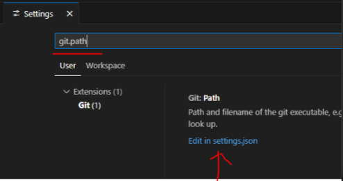
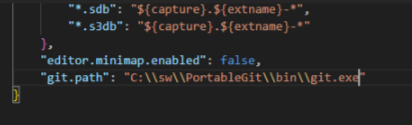
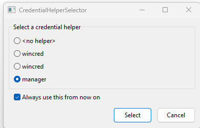

# No Windows Admin Installs

A comprehensive guide for installing development tools and databases on Windows without administrator privileges.

## Table of Contents

1. [Overview](#overview)
2. [Prerequisites](#prerequisites)
3. [Development Tools](#development-tools)
   - [VSCode](#installing-vscode)
   - [Git](#installing-git)
   - [.NET SDK](dotnet-no-admin.md)
   - [Python](python-no-admin.md)
   - [Node.js](node-no-admin.md)
4. [Databases](#databases)
   - [PostgreSQL](postgresql-no-admin.md)
   - [MySQL](mysql-no-admin.md)
5. [System Configuration](#system-configuration)
   - [Environment Variables](#setup-environment-variables)
   - [VSCode Configuration](#vscode-configuration-for-all-projects)
   - [Windows Registry Tweaks](#windows-registry-tweaks)
6. [Troubleshooting](#troubleshooting)

## Overview

This repository provides step-by-step instructions for installing essential development tools and databases on Windows systems without requiring administrator privileges. All installations use portable versions or user-space installations.

## Prerequisites

- Windows 10 or later
- User account with standard privileges (no admin required)
- Internet connection for downloading packages
- Basic familiarity with command line operations

## Development Tools

### Installing VSCode

Visual Studio Code is a lightweight, powerful code editor that can be installed without admin rights.

#### Steps

1. **Download VSCode**
   - Go to [VSCode Downloads](https://code.visualstudio.com/download)
   - Select the **Windows .zip** version (not the installer)
   
   

2. **Extract and Install**
   ```cmd
   # Create directory structure
   mkdir C:\sw\code
   
   # Extract downloaded zip to C:\sw\code
   ```

3. **Add to PATH**
   - Add `C:\sw\code\bin` to your [PATH environment variable](#setup-environment-variables)

4. **Verify Installation**
   ```cmd
   code --version
   ```

---

### Installing Git

Git is essential for version control and can be installed using the portable version.

#### Steps

1. **Download Git Portable**
   - Go to [Git Downloads](https://git-scm.com/downloads/win)
   - Select **Portable ("thumbdrive edition")**
   
   

2. **Extract and Install**
   ```cmd
   # Create directory
   mkdir C:\sw\PortableGit
   
   # Extract downloaded file to C:\sw\PortableGit
   ```

3. **Add to PATH**
   - Add both `C:\sw\PortableGit` and `C:\sw\PortableGit\bin` to your [PATH](#setup-environment-variables)

4. **Configure Git in VSCode**
   - Open VSCode settings (`Ctrl + ,`)
   - Search for `git.path`
   - Click "Edit in settings.json"
   
   
   
   
   Add this configuration:
   ```json
   "git.path": "C:\\sw\\PortableGit\\bin\\git.exe"
   ```

5. **Configure Git User**
   ```bash
   git config --global user.name "Your Name"
   git config --global user.email "your.email@example.com"
   ```

6. **Test Git Integration**
   - On first push, you'll see the credential manager
   
   
   
   - Choose "Use browser" for authentication

---

## System Configuration

### Setup Environment Variables

#### Using Command Line (Quick Method)
```cmd
setx PATH "%PATH%;C:\sw\PortableGit;C:\sw\PortableGit\bin;C:\sw\code\bin;"
```

#### Using GUI (Recommended Method)
```cmd
rundll32 sysdm.cpl,EditEnvironmentVariables
```

> **⚠️ Warning:** Using `SETX` with variables sets the current value, not future values. The GUI method is recommended for permanent changes.

### VSCode Configuration for All Projects

Create or edit the global settings file:
**Location:** `%userprofile%\AppData\Roaming\Code\User\settings.json`

```json
{
  "git.path": "C:\\sw\\PortableGit\\bin\\git.exe",
  "editor.fontSize": 18,
  "terminal.integrated.defaultProfile.windows": "Command Prompt",
  "terminal.integrated.fontSize": 18,
  "editor.tabSize": 2,
  "workbench.colorCustomizations": {
    "terminal.foreground": "#1AFF01",
    "terminal.background": "#000000"
  },
  "terminal.integrated.cursorBlinking": true,
  "editor.minimap.enabled": false,
  "hediet.vscode-drawio.resizeImages": null
}
```

### Install VSCode Extensions

```cmd
code --install-extension humao.rest-client
code --install-extension shd101wyy.markdown-preview-enhanced
code --install-extension ms-python.debugpy
code --install-extension ritwickdey.liveserver
code --install-extension github.copilot
code --install-extension hediet.vscode-drawio
code --install-extension yy0931.vscode-sqlite3-editor
code --install-extension github.copilot-chat

# List installed extensions
code --list-extensions
```

### Windows Registry Tweaks

Registry tweaks allow you to add useful context menu options and customize Windows behavior. Follow these steps to safely apply registry modifications.

#### How to Create and Apply Registry Files

1. **Create a new text file** with `.reg` extension
2. **Copy the registry content** into the file
3. **Save the file** (ensure it has `.reg` extension)
4. **Double-click the file** to apply the changes
5. **Confirm the security prompt** when Windows asks for permission

#### Add "Open with VSCode" to Context Menu

**Step 1: Create the Registry File**

Create a file named `vscode-context-menu.reg`:

```cmd
notepad vscode-context-menu.reg
```

**Step 2: Add Registry Content**

Copy this content into the file:

```reg
Windows Registry Editor Version 5.00

[HKEY_CURRENT_USER\Software\Classes\Directory\shell\Open with VSCode]
@="Open with VSCode"
"Icon"="C:\\sw\\code\\bin\\Code.exe"

[HKEY_CURRENT_USER\Software\Classes\Directory\shell\Open with VSCode\command]
@="\"C:\\sw\\code\\bin\\code.exe\" \"%V\""

[HKEY_CURRENT_USER\Software\Classes\Directory\Background\shell\Open with VSCode]
@="Open with VSCode"
"Icon"="C:\\sw\\code\\bin\\Code.exe"

[HKEY_CURRENT_USER\Software\Classes\Directory\Background\shell\Open with VSCode\command]
@="\"C:\\sw\\code\\bin\\code.exe\" \"%V\""
```

**Step 3: Apply the Registry Changes**

1. **Double-click** `vscode-context-menu.reg`
2. **Click "Yes"** when prompted: "Are you sure you want to continue?"
3. **Click "Yes"** when prompted: "Do you want to allow this app to make changes?"
4. **Click "OK"** when you see: "The keys and values contained in vscode-context-menu.reg have been successfully added to the registry."

**What to Expect:**
- Right-click on any folder → See "Open with VSCode" option
- Right-click in empty space inside a folder → See "Open with VSCode" option
- VSCode will open with the selected folder as the workspace

#### Add "Open in Terminal" to Context Menu

**Step 1: Create the Registry File**

Create a file named `terminal-context-menu.reg`:

```cmd
notepad terminal-context-menu.reg
```

**Step 2: Add Registry Content**

Copy this content into the file:

```reg
Windows Registry Editor Version 5.00

[HKEY_CURRENT_USER\SOFTWARE\Classes\Directory\Background\shell\Open in Terminal]
@="Open in Terminal"
"Icon"="%SystemRoot%\\System32\\shell32.dll,40"

[HKEY_CURRENT_USER\SOFTWARE\Classes\Directory\Background\shell\Open in Terminal\command]
@="cmd.exe /K cd \"%V\""

[HKEY_CURRENT_USER\SOFTWARE\Classes\Directory\shell\Open in Terminal]
@="Open in Terminal"
"Icon"="%SystemRoot%\\System32\\shell32.dll,40"

[HKEY_CURRENT_USER\SOFTWARE\Classes\Directory\shell\Open in Terminal\command]
@="cmd.exe /K cd \"%V\""
```

**Step 3: Apply the Registry Changes**

1. **Double-click** `terminal-context-menu.reg`
2. **Follow the same confirmation steps** as above

**What to Expect:**
- Right-click on any folder → See "Open in Terminal" option
- Right-click in empty space inside a folder → See "Open in Terminal" option
- Command prompt will open with the current directory set to the selected folder

#### Add "Open in PowerShell" to Context Menu (Bonus)

**Step 1: Create the Registry File**

Create a file named `powershell-context-menu.reg`:

```cmd
notepad powershell-context-menu.reg
```

**Step 2: Add Registry Content**

```reg
Windows Registry Editor Version 5.00

[HKEY_CURRENT_USER\SOFTWARE\Classes\Directory\Background\shell\Open in PowerShell]
@="Open in PowerShell"
"Icon"="powershell.exe"

[HKEY_CURRENT_USER\SOFTWARE\Classes\Directory\Background\shell\Open in PowerShell\command]
@="powershell.exe -NoExit -Command Set-Location '%V'"

[HKEY_CURRENT_USER\SOFTWARE\Classes\Directory\shell\Open in PowerShell]
@="Open in PowerShell"
"Icon"="powershell.exe"

[HKEY_CURRENT_USER\SOFTWARE\Classes\Directory\shell\Open in PowerShell\command]
@="powershell.exe -NoExit -Command Set-Location '%V'"
```

**What to Expect:**
- Right-click on any folder → See "Open in PowerShell" option
- PowerShell will open with the current directory set to the selected folder

#### Registry Safety Tips

⚠️ **Important Safety Guidelines:**

1. **Backup First:** Before making registry changes, create a backup:
   ```cmd
   reg export HKEY_CURRENT_USER\Software\Classes backup-classes.reg
   ```

2. **Test First:** Apply changes on a test folder to verify they work correctly

3. **User Registry Only:** These tweaks only modify `HKEY_CURRENT_USER`, which is safe and doesn't require admin rights

4. **Remove if Needed:** To remove these context menu items, create removal registry files:

**Remove VSCode Context Menu (`remove-vscode-context.reg`):**
```reg
Windows Registry Editor Version 5.00

[-HKEY_CURRENT_USER\Software\Classes\Directory\shell\Open with VSCode]
[-HKEY_CURRENT_USER\Software\Classes\Directory\Background\shell\Open with VSCode]
```

**Remove Terminal Context Menu (`remove-terminal-context.reg`):**
```reg
Windows Registry Editor Version 5.00

[-HKEY_CURRENT_USER\SOFTWARE\Classes\Directory\Background\shell\Open in Terminal]
[-HKEY_CURRENT_USER\SOFTWARE\Classes\Directory\shell\Open in Terminal]
```

#### Troubleshooting Registry Issues

**Problem:** Context menu items don't appear
**Solutions:**
- Restart Windows Explorer: `taskkill /f /im explorer.exe && start explorer.exe`
- Log off and log back in
- Verify the registry file was applied successfully

**Problem:** Wrong application path
**Solutions:**
- Verify VSCode is installed at `C:\sw\code\bin\code.exe`
- Update the registry file with the correct path
- Reapply the registry file

**Problem:** Permission denied when applying registry file
**Solutions:**
- Ensure you're modifying `HKEY_CURRENT_USER` (not `HKEY_LOCAL_MACHINE`)
- Run as current user (not administrator)
- Check if antivirus is blocking the operation

### Command Prompt Customization

#### Set Colors and Prompt
```cmd
# Set green text color
reg add "HKCU\Software\Microsoft\Command Processor" /v DefaultColor /t REG_DWORD /d 0x0a /f

# Set custom prompt
SETX PROMPT $+$M$_$P$_$$$S
```

#### PowerShell Prompt Customization

Customize your PowerShell prompt to show hostname, current directory, and improve readability.

> **⚠️ Important:** All commands in this section must be run inside a **PowerShell console**, not Command Prompt (cmd).

**Step 0: Open PowerShell**

1. **Press `Win + R`** and type `powershell`, then press Enter
2. **Or** search for "PowerShell" in Start Menu
3. **Or** use Windows Terminal and select PowerShell tab

**Step 1: Check if PowerShell Profile Exists**

```powershell
Test-Path $PROFILE
```

**Step 2: Create PowerShell Profile (if it doesn't exist)**

```powershell
# Create the profile directory if it doesn't exist
New-Item -ItemType Directory -Path (Split-Path $PROFILE) -Force

# Create the profile file
New-Item -ItemType File -Path $PROFILE -Force
```

**Step 3: Edit PowerShell Profile**

> **Note:** Run this command in PowerShell (not cmd) to open the correct profile file.

```powershell
notepad $PROFILE
```

**How to identify if you're in PowerShell:**
- PowerShell prompt shows: `PS C:\Users\YourName>`
- Command Prompt shows: `C:\Users\YourName>`

**Step 4: Add Custom Prompt Function**

Copy this content into your PowerShell profile:

```powershell
# Custom PowerShell Prompt with Hostname
function prompt {
    $hostname = $env:COMPUTERNAME
    $currentPath = Get-Location
    $userName = $env:USERNAME
    
    # Display hostname and user
    Write-Host "[$userName@$hostname]" -ForegroundColor Green -NoNewline
    Write-Host "`nPS " -ForegroundColor Yellow -NoNewline
    Write-Host "$currentPath" -ForegroundColor Blue
    Write-Host "$ " -ForegroundColor White -NoNewline
    
    return " "
}

# Optional: Set window title to show current directory
$Host.UI.RawUI.WindowTitle = "PowerShell - $(Get-Location)"

# Optional: Clear screen on startup
# Clear-Host
```

**Alternative Compact Version:**

```powershell
# Compact version with hostname on same line
function prompt {
    $hostname = $env:COMPUTERNAME
    $currentPath = Get-Location
    $userName = $env:USERNAME
    
    Write-Host "[$userName@$hostname] " -ForegroundColor Green -NoNewline
    Write-Host "PS $currentPath" -ForegroundColor Cyan -NoNewline
    Write-Host " $ " -ForegroundColor White -NoNewline
    
    return " "
}
```

**Step 5: Apply Changes**

1. **Save the profile file** (`Ctrl+S` in Notepad)
2. **Restart PowerShell** or reload the profile:
   ```powershell
   . $PROFILE
   ```

**What to Expect:**

**Standard Version Output:**
```
[YourUsername@YourComputer]
PS C:\Users\YourUsername\Documents
$ 
```

**Compact Version Output:**
```
[YourUsername@YourComputer] PS C:\Users\YourUsername\Documents $ 
```

**Advanced Customization Options:**

```powershell
# Advanced prompt with Git branch support (requires Git)
function prompt {
    $hostname = $env:COMPUTERNAME
    $currentPath = Get-Location
    $userName = $env:USERNAME
    
    # Check if we're in a Git repository
    $gitBranch = ""
    if (Get-Command git -ErrorAction SilentlyContinue) {
        $gitStatus = git status --porcelain -b 2>$null
        if ($gitStatus) {
            $branch = (git branch --show-current 2>$null)
            if ($branch) {
                $gitBranch = " (git:$branch)"
            }
        }
    }
    
    # Display prompt
    Write-Host "[$userName@$hostname]" -ForegroundColor Green -NoNewline
    Write-Host "$gitBranch" -ForegroundColor Magenta -NoNewline
    Write-Host "`nPS " -ForegroundColor Yellow -NoNewline
    Write-Host "$currentPath" -ForegroundColor Blue
    Write-Host "$ " -ForegroundColor White -NoNewline
    
    return " "
}
```

**Troubleshooting PowerShell Profile Issues:**

**Problem:** Commands not recognized or "$PROFILE" shows as literal text
**Solution:**
- Ensure you're running commands in **PowerShell**, not Command Prompt
- PowerShell prompt shows `PS C:\>` while cmd shows `C:\>`
- Open PowerShell: `Win + R` → type `powershell` → Enter

**Problem:** "Execution policy" error when loading profile
**Solution:**
```powershell
# Check current execution policy
Get-ExecutionPolicy

# Set execution policy for current user
Set-ExecutionPolicy -ExecutionPolicy RemoteSigned -Scope CurrentUser
```

**Problem:** Profile doesn't load automatically
**Solution:**
- Verify profile location: `echo $PROFILE`
- Check if file exists: `Test-Path $PROFILE`
- Manually reload: `. $PROFILE`

**Problem:** Colors don't display correctly
**Solution:**
- Use Windows Terminal or PowerShell 7 for better color support
- Test colors: `Write-Host "Test" -ForegroundColor Red`

**Useful PowerShell Profile Locations:**

```powershell
# Show all profile paths
$PROFILE | Get-Member -Type NoteProperty

# Current user, current host
$PROFILE.CurrentUserCurrentHost

# Current user, all hosts
$PROFILE.CurrentUserAllHosts
```

**Profile File Locations:**
- **Current User:** `%USERPROFILE%\Documents\PowerShell\Microsoft.PowerShell_profile.ps1`
- **Windows PowerShell:** `%USERPROFILE%\Documents\WindowsPowerShell\Microsoft.PowerShell_profile.ps1`

---

## Troubleshooting

### Common Issues

#### PATH Not Updated
- **Problem:** Commands not recognized after installation
- **Solution:** 
  1. Close and reopen command prompt
  2. Use the GUI method for setting environment variables
  3. Verify PATH contains the correct directories

#### Git Not Working in VSCode
- **Problem:** VSCode can't find Git
- **Solution:** 
  1. Check `git.path` setting in VSCode
  2. Ensure Git is in PATH
  3. Restart VSCode after configuration changes

#### Permission Errors
- **Problem:** Access denied when creating directories
- **Solution:** 
  1. Ensure you're using user-writable directories (C:\sw\)
  2. Check if antivirus is blocking operations
  3. Try running command prompt as current user (not admin)

### Useful File Locations

```cmd
# VSCode extensions
%userprofile%\.vscode\extensions

# VSCode user settings
%userprofile%\AppData\Roaming\Code\User\settings.json

# Open environment variables GUI
rundll32 sysdm.cpl,EditEnvironmentVariables
```

---

## Related Links

- [VSCode Download](https://code.visualstudio.com/download)
- [Git Download](https://git-scm.com/downloads/win)
- [.NET Installation Guide](dotnet-no-admin.md)
- [Python Installation Guide](python-no-admin.md)
- [Node.js Installation Guide](node-no-admin.md)
- [PostgreSQL Installation Guide](postgresql-no-admin.md)
- [MySQL Installation Guide](mysql-no-admin.md)